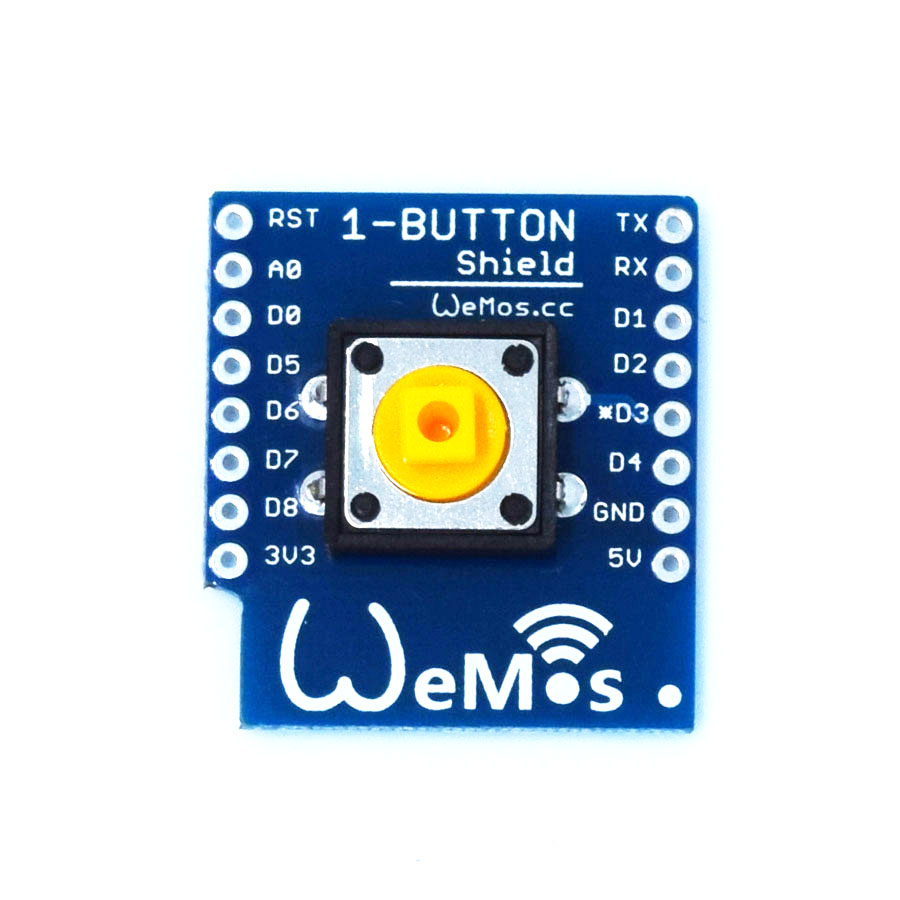

1-Button Shield is simple button shield, you can use it for 1-Button IOT application.

## Schematics
[mini_1_button.pdf](./images/mini_1_button.pdf)

## Pin

|D1 mini|Shield|
|D3|Button|

## Arduino Code
  - Find code in Arduino IDE:\\
`File->Sketchbook->libraries->D1_mini_Examples->04.Shields`