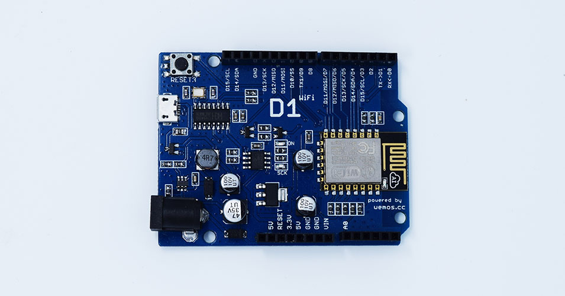
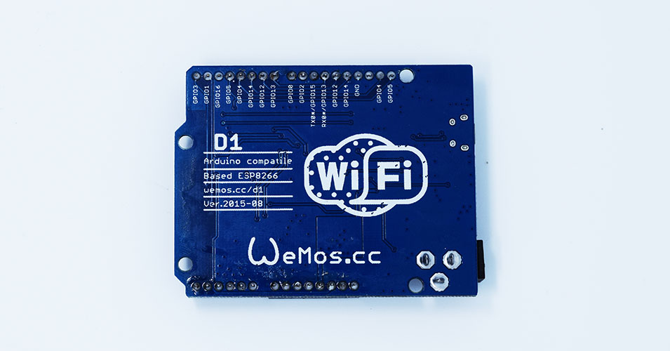

---
layout: tutorial
title: "D1 (retired)"
---  

**The D1 is retired now, the new version is [D1 R2](./d1_r2.html).**

The D1 is an Arduino Uno-like wifi board based on ESP-8266EX. 

  * 11 digital input/output pins
  * 1 analog input(3.2V max input)
  * a Micro USB connection
  * a power jack, 9-24V power input.
  * Compatible with [Arduino](https://github.com/esp8266/Arduino)

## Getting Started

### Arduino

  * [Getting Started in Arduino](/Tutorial/get_started_in_arduino.html)

## Technical specs

|Microcontroller| ESP-8266EX     | 
|Operating Voltage|3.3V|
|Digital I/O Pins| 11|
|Analog Input Pins|1(Max input: 3.2V)|
|Clock Speed|80MHz/160MHz|
|Flash|4M bytes|
|Length|68.6 mm|
|Width|53.4 mm|
|Weight|25g|

## Documentation

### Board size

[d1_size.jpg](./images/d1_size.jpg)

### Schematics

[d1.pdf](./images/d1.pdf)

## Pin

| Pin | Function |ESP-8266 Pin|
|D0|RX|GPIO3|
|D1|TX|GPIO1|
|D2|IO|GPIO16|
|D3 (D15)|IO, SCL|GPIO5|
|D4 (D14)|IO, SDA|GPIO4|
|D5 (D13)|IO, SCK|GPIO14|
|D6 (D12)|IO, MISO|GPIO12|
|D7 (D11)|IO, MOSI|GPIO13|
|D8|IO, Pull-up|GPIO0|
|D9|IO, Pull-up, BUILTIN_LED|GPIO2|
|D10|IO, Pull-down,SS|GPIO15|
|A0|Analog Input|A0|

***All IO have interrupt/pwm/I2C/one-wire supported(except D2)**

## Programming
The **D1** has a micro USB for auto programming.\\
You can also program it using OTA.

## Warnings
**All of the IO pins run at 3.3V.**