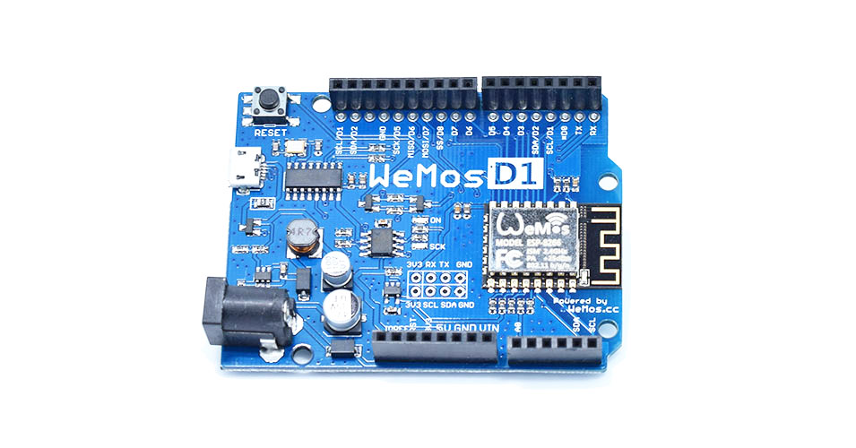

---
layout: tutorial
title: "D1 R2"
---  

This page is about new D1 board named **D1 R2**.

The **D1 R2** is a mini wifi board based on the ESP-8266EX.

  * 11 digital input/output pins, all pins have interrupt/pwm/I2C/one-wire supported(except for **D0**)
  * 1 analog input(3.2V max input)
  * Micro USB connection
  * Power jack, 9-24V power input.
  * Compatible with [Arduino](https://github.com/esp8266/Arduino)
  * Compatible with [nodemcu](http://www.nodemcu.com)

## Getting Started

### Arduino

  * [Getting Started in Arduino](/tutorial/get_started_in_arduino.html)

### NodeMcu

  * [Getting Started in NodeMCU](/tutorial/get_started_in_nodemcu.html)

## Technical specs

|Microcontroller| ESP-8266EX     | 
|Operating Voltage|3.3V|
|Digital I/O Pins| 11|
|Analog Input Pins|1(Max input: 3.2V)|
|Clock Speed|80MHz/160MHz|
|Flash|4M bytes|
|Length|68.6mm|
|Width|53.4mm|
|Weight|25g|

## Documentation

### Board size

[d1_r2_size.png](./images/d1_r2_size.png)

### Schematics

[d1_r2.pdf](./images/d1_r2.pdf)

## Pin

| Pin | Function |ESP-8266 Pin|
|TX|TXD|TXD|
|RX|RXD|RXD|
|A0|Analog input, max 3.3V input |A0|
|D0|IO|GPIO16|
|D1|IO, SCL|GPIO5|
|D2|IO, SDA|GPIO4|
|D3|IO, 10k Pull-up|GPIO0|
|D4|IO, 10k Pull-up, BUILTIN_LED|GPIO2|
|D5|IO, SCK|GPIO14|
|D6|IO, MISO|GPIO12|
|D7|IO, MOSI|GPIO13|
|D8|IO, 10k Pull-down, SS |GPIO15|
|G|Ground|GND|
|5V|5V|-|
|3V3|3.3V|3.3V|
|RST|Reset|RST|

***All of the IO pins have interrupt/pwm/I2C/one-wire support except D0***

## Programming
The **D1 R2** has a micro USB for auto programming.\\
You can also program it using OTA.

## Warnings
**All of the IO pins run at 3.3V.**