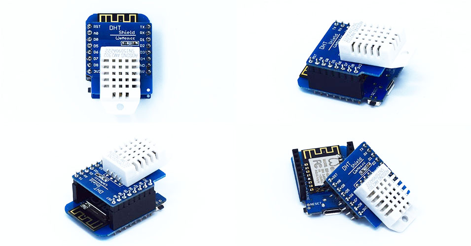

DHT Pro Shield is a digital temperature and humidity sensor shield based DHT22.

## Important
The temperature and humidity data read from sensor is the result of the last measurement (the sensor will measure after you read). \\
To get real-time data, you need read twice.\\
But not recommended to repeatedly reading sensor, reading interval should be more than 2 seconds.

## Technical specs

  * **Temperature:** -40~80°C (±0.5°C)
  * **Humidity:** 0-99.9%RH (±2%RH)

## Schematics
[mini_dht11.pdf](./images/mini_dht11.pdf)

## Pin

|D1 mini|Shield|
|D4|Data out|

## Arduino Code

  - Install [DHT sensor library](https://github.com/adafruit/DHT-sensor-library)
  - Find code in Arduino IDE:\\
`File->Sketchbook->libraries->D1_mini_Examples->04.Shields->DHT_Shield`

## NodeMCU Code
* Build firmware from Marcel's [NodeMCU custom build](http://nodemcu-build.com/) cloud service.
* Flash firmware by [esptool-ck](https://github.com/igrr/esptool-ck)
* Example

pin = 4
status, temp, humi, temp_dec, humi_dec = dht.read(pin)
if status == dht.OK then
    -- Integer firmware using this example
    print(string.format("DHT Temperature:%d.%03d;Humidity:%d.%03d\r\n",
          math.floor(temp),
          temp_dec,
          math.floor(humi),
          humi_dec
    ))

    -- Float firmware using this example
    print("DHT Temperature:"..temp..";".."Humidity:"..humi)

elseif status == dht.ERROR_CHECKSUM then
    print( "DHT Checksum error." )
elseif status == dht.ERROR_TIMEOUT then
    print( "DHT timed out." )
end


* [Reference](http://nodemcu.readthedocs.org/en/dev/en/modules/dht/)