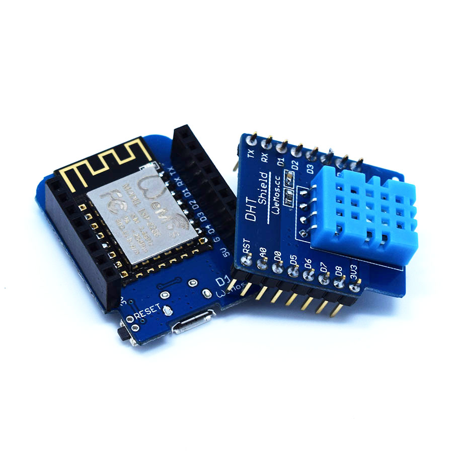
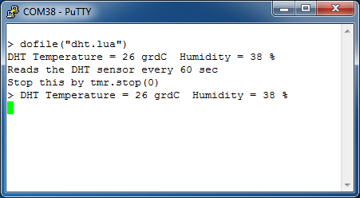

DHT Shield is a digital temperature and humidity sensor shield based DHT11.

## Technical specs
  * **Temperature:** 0~60°C (±2°C)
  * **Humidity:** 20-90%RH (±5%RH)

## Schematics
[mini_dht11.pdf](./images/mini_dht11.pdf)

## Pin

|D1 mini|Shield|
|D4|Data out|

## Arduino Code

  - Install [DHT sensor library](https://github.com/adafruit/DHT-sensor-library)
  - Find code in Arduino IDE:\\
`File->Sketchbook->libraries->D1_mini_Examples->04.Shields->DHT_Shield`

## NodeMCU Code
  - Install last firmware version from [Latest release](https://github.com/nodemcu/nodemcu-firmware/releases)
  - Use the floaing point version nodemcu_float_0.9.6-dev_20150704.bin
  - Download [dht.lua](http://sourceforge.net/projects/nodemcu/files/dht.lua)
  - Run on DHT shield/D1 board package
  - See [CKNodeMCU](https://cknodemcu.wordpress.com) for further information

