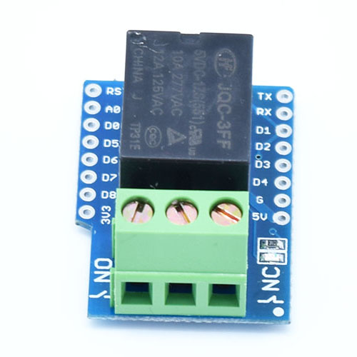

---
layout: tutorial
title: "D1 mini Shields"
---  

### Sensor

#### DHT Shield
[DHT Shield](./dht_shield.html) is a digital temperature and humidity sensor shield based DHT11.\\
**Temperature:** 0~60°C (±2°C)\\
**Humidity:** 20-90%RH (±5%RH)\\
[Buy](http://www.aliexpress.com/store/product/DHT-Shield-for-WeMos-D1-mini-DHT11-Single-bus-digital-temperature-and-humidity-sensor-module-sensor/1331105_32534235492.html)

#### DHT Pro Shield
[DHT ProShield](./dht_pro_shield.html) is a digital temperature and humidity sensor shield based DHT22.\\
**Temperature:** -40~80°C (±0.5°C)\\
**Humidity:** 0-99.9%RH (±2%RH)\\
[Buy](http://www.aliexpress.com/store/product/DHT-Pro-Shield-for-WeMos-D1-mini-DHT22-Single-bus-digital-temperature-and-humidity-sensor-module/1331105_32570893524.html)

### Interactive

#### 1-Button Shield
[1-Button Shield](./button_shield.html) is simple button shield, you can use it for 1-Button IOT application.\\
\\
\\
[Buy](http://www.aliexpress.com/store/product/1-Button-Shield-for-WeMos-D1-mini-button/1331105_32575988167.html)

### Control

#### Relay Shield
[Relay Shield](./relay_shield.html), use relay to control other equipment.\\
**NO:** 5A(250VAC/30VDC), 10A(125VAC), **MAX:**1250VA/150W\\
**NC:** 3A(250VAC/30VDC), **MAX:**750VA/90W\\
[Buy](http://www.aliexpress.com/store/product/Relay-Shield-for-WeMos-D1-mini-button/1331105_32596395175.html)

### Storage

#### Micro SD Shield
[Micro SD Shield](./micro_sd_shield.html) is a shield to use Micro SD(TF) card for D1 mini.\\
\\
\\
[Buy](http://www.aliexpress.com/store/product/Micro-SD-Shield-for-WeMos-D1-mini-TF/1331105_32578362865.html)

