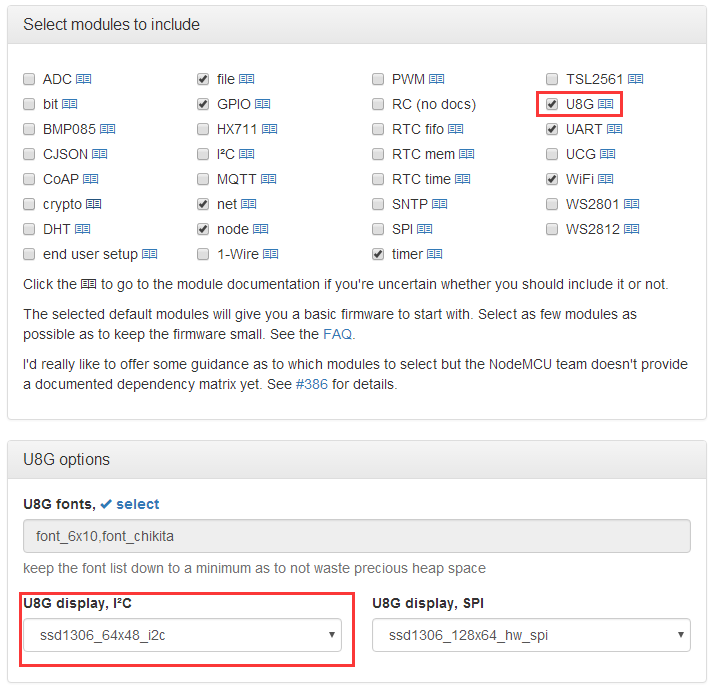

- **Screen Size:** 64x48 pixels (0.66" Across)
- **Operating Voltage:** 3.3V
- **Driver IC:** SSD1306
- **Interface:** IIC(I2C)
- **IIC Address:** 0x3C or 0x3D

## Schematics

[mini_OLED.pdf](./images/mini_OLED.pdf)

## Pin

|D1 mini|Shield|
|D1|SCL|
|D2|SDA|

## Arduino Code

### SparkFun Library

- Install [SparkFun_Micro_OLED_Arduino_Library](https://github.com/sparkfun/SparkFun_Micro_OLED_Arduino_Library/tree/master)
- Find code in Arduino IDE:\\
`File->Sketchbook->libraries->D1_mini_Examples->04.Shields`

### Adafruit SSD1306 Library

- Install [Adafruit_SSD1306_Library](https://github.com/mcauser/Adafruit_SSD1306/tree/esp8266-64x48) (Add support by [@mcauser](https://github.com/mcauser))
- [Test Code](https://github.com/mcauser/Adafruit_SSD1306/blob/esp8266-64x48/examples/ssd1306_64x48_i2c/ssd1306_64x48_i2c.ino)

## NodeMCU Code
- Build and flash nodemcu firmware with U8G module, and make sure use "ssd1306_64x48_i2c". (It's easy build from [nodemcu-build.com](http://nodemcu-build.com/))

- Test code:
[oled_test.lua](https://github.com/wemos/D1_mini_Examples_lua/blob/master/Shields/OLED_Shields/oled_test.lua)
