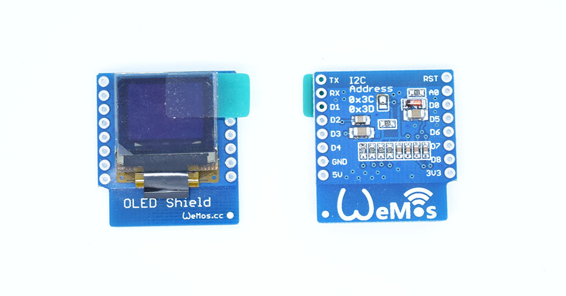

- **Screen Size:** 64x48 pixels (0.66" Across)
- **Operating Voltage:** 3.3V
- **Driver IC:** SSD1306
- **Interface:** IIC(I2C)
- **IIC Address:** 0x3C or 0x3D

## Schematics

[mini_OLED.pdf](./images/mini_OLED.pdf)

## Pin

|D1 mini|Shield|
|D1|SCL|
|D2|SDA|

## Arduino Code

- Install [SparkFun_Micro_OLED_Arduino_Library](https://github.com/sparkfun/SparkFun_Micro_OLED_Arduino_Library/tree/master)
- Find code in Arduino IDE:\\
`File->Sketchbook->libraries->D1_mini_Examples->04.Shields`

## NodeMCU Code