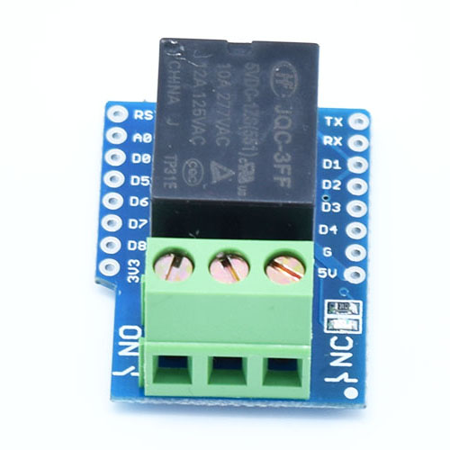

Relay Shield, use relay to control other equipment.

## Technical specs
- **NO:** 5A(250VAC/30VDC), 10A(125VAC), **MAX:**1250VA/150W
- **NC:** 3A(250VAC/30VDC), **MAX:**750VA/90W

## Schematics
[mini_relay.pdf](./images/mini_relay.pdf)

## Pin

|D1 mini|Shield|
|D1|Relay|

## Arduino Code
  - Find code in Arduino IDE:\\
`File->Sketchbook->libraries->D1_mini_Examples->04.Shields`