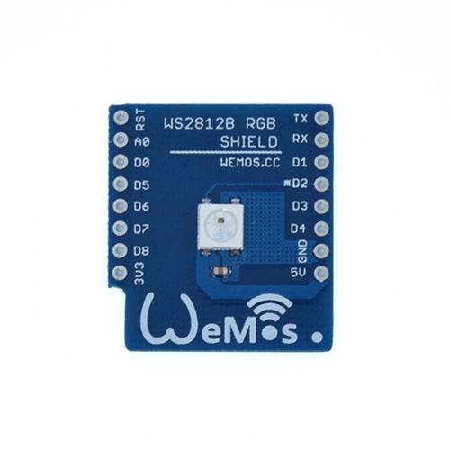

## Technical specs
* **LED SIZE:** 5050
* **colors:** 16777216 
* **Voltage:** 5V

## Schematics
[ws2812b.pdf](./images/ws2812b.pdf)

## Pin

|D1 mini|Shield|
|D2|WS2812B|

## Arduino Code

* Install [Adafruit_NeoPixel_Library](https://github.com/adafruit/Adafruit_NeoPixel)
* Find code in Arduino IDE:\\
`File->Sketchbook->libraries->D1_mini_Examples->04.Shields`