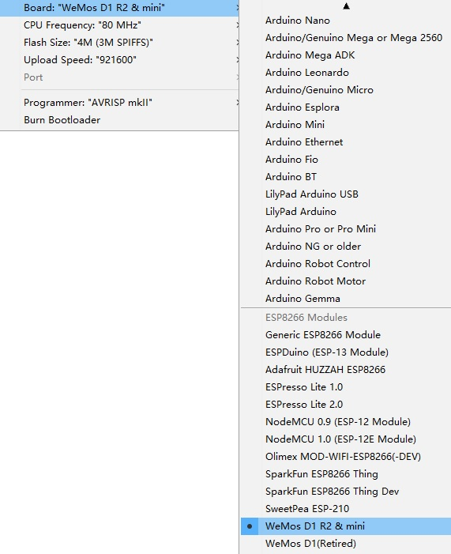

---
layout: tutorial
title: "Get started in Arduino"
---  

### Requirements
* [ch340g](/downloads/) driver.
* Python 2.7

### Installing Hardware package

There is two ways to install hardware package, Boards Manager and git.

#### Installing with Boards Manager

Starting with 1.6.4, Arduino allows installation of third-party platform packages using Boards Manager. We have packages available for Windows, Mac OS, and Linux (32 and 64 bit).

```
1. Install Arduino 1.6.7 from the Arduino website.

2. Start Arduino and open Preferences window.

3. Enter 
   
   http://arduino.esp8266.com/stable/package_esp8266com_index.json
   
   into Additional Boards Manager URLs field. 
   You can add multiple URLs, separating them with commas.

4. Open Tools→Board:xxx→Boards Manager and install esp8266 by ESP8266 Community 
   (and don't forget to select your ESP8266 board from Tools > Board menu after installation).
```

#### Installing use git (Recommend)

We recommend using git to install Hardware package, you can always get the latest version of it.

##### Install Arduino 

Install Arduino 1.6.7 from the Arduino website.

##### Clone repository

Clone repository into **[Sketchbook_directory][Sketchbook_directory]/hardware/esp8266com/esp8266** directory (or clone it elsewhere and create a symlink), you may need to create the hardware directory if it does not exist.


cd hardware
mkdir esp8266com
cd esp8266com
git clone https://github.com/esp8266/Arduino.git esp8266


You should end up with the following directory structure:


─┬ Arduino
 └─┬ hardware
   └─┬ esp8266com
     └─┬ esp8266
       ├── bootloaders
       ├── cores
       ├── doc
       ├── libraries
       ├── package
       ├── tests
       ├── tools
       ├── variants
       ├── platform.txt
       ├── programmers.txt
       ├── README.md
       ├── boards.txt
       ├── LICENSE


##### Download binary tools


cd esp8266/tools
python get.py


##### Restart the Arduino IDE

To get the latest version anytime, in **[Sketchbook_directory][Sketchbook_directory]/hardware/esp8266com/esp8266** simply run


git pull


##### Configure Board

After install hardware package, you will see WeMos boards in the Tools→Board:xxx 

Choose your own board.



```
Upload Using:
Serial – Use USB port on board to upload flash
OTA – Use OTA to upload flash

CPU Frequency:
80MHz
160MHz

Flash Size:
4M (3M SPIFFS) – 3M File system size
4M (1M SPIFFS) – 1M File system size

Upload Speed:
921600 bps – recommend
```

### Installing Examples

#### Simple Way

* Download Examples files form here.
* Rename the uncompressed directory to D1_mini_Examples
* Move directory to [Sketchbook_directory][Sketchbook_directory]
* The path will look like **[Sketchbook_directory][Sketchbook_directory]/D1_mini_Examples**
* Restart the Arduino IDE
* All examples are under `File→Sketchbook→D1_mini_Examples`

#### Git Way (Recommend)

We recommend using git to install Examples, you can always get the latest version of it.

* Clone repository into [Sketchbook_directory][Sketchbook_directory] directory (or clone it elsewhere and create a symlink).



cd Sketchbook_directory
git clone https://github.com/wemos/D1_mini_Examples.git


* Restart the Arduino IDE
All examples are under File→Sketchbook→D1_mini_Examples

### Hello world!

* Open File→Sketchbook→D1_mini_Examples→01.Basics→HelloWorld
* Click Upload
* After upload, open Tools→Serial Monitor, set baudrate to 9600 baud.
* Have fun!

[Sketchbook_directory]: ./sketchbook_directory.html